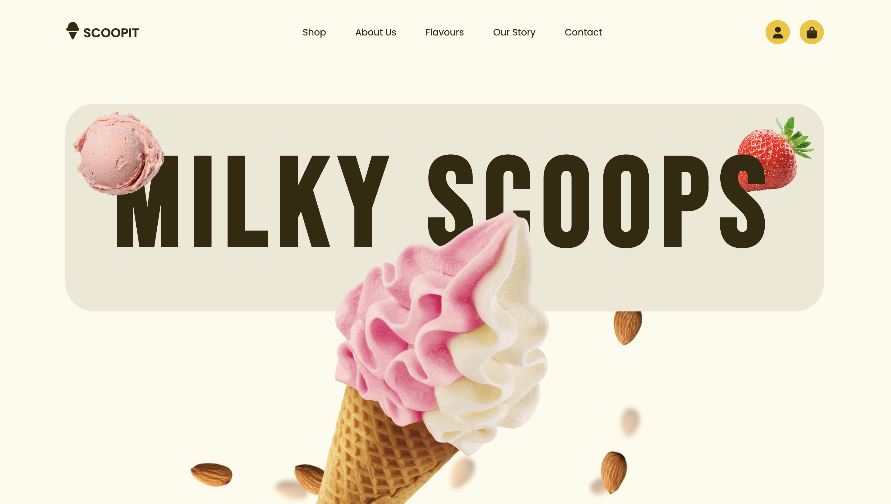

# 🍦 Winter Special Ice-Cream Website

A visually rich, winter-themed ice-cream landing page created using **HTML**, **CSS**, and **GSAP (GreenSock Animation Platform)**. This single-page site features smooth scroll-triggered animations and a festive seasonal design.

---

## 📸 Preview

  
*A static preview of the hero and flavor sections.*

---

## 🚀 Features

- ❄️ Animated winter-style hero section
- 🍫 Flavor cards with scroll animations
- 🎯 GSAP + ScrollTrigger for clean transitions
- 🌟 Custom design with snow/winter aesthetic

> ⚠️ **Note**: This project is **not responsive** by default. It is optimized for desktop view only.

---

## 🛠️ Built With

- **HTML5** – Page markup
- **CSS3** – Styling and layout
- **GSAP 3** – Animation library
- **GSAP ScrollTrigger** – Scroll-based animations

---

## 🧰 How to Use

1. Download or clone the repository.
2. Open the `index.html` file in a web browser.
3. Scroll to see animated elements as they enter the viewport.

---

## ✨ Customization Tips

- Replace images like `winter-bg.jpg`, `vanilla.png`, and `choco.png` with your own assets.
- Modify `style.css` to adjust the layout, color scheme, or typography.
- Enhance animations or interactions in `main.js` using [GSAP's official docs](https://gsap.com/docs/v3/).

---

## 📄 License

This project is for learning and demonstration purposes. You are free to modify and use it for personal or non-commercial projects.

---

## 🙌 Credit

Inspired by a YouTube tutorial on animated landing pages using GSAP:  
[Winter Ice-Cream Website Tutorial](https://www.youtube.com/watch?v=O6SoViGU-BE)

